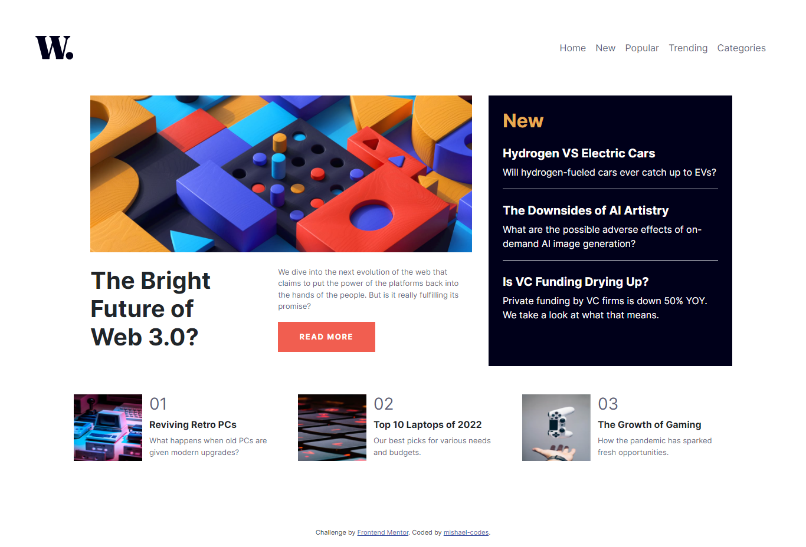

# Frontend Mentor - News homepage solution

This is a solution to the [News homepage challenge on Frontend Mentor](https://www.frontendmentor.io/challenges/news-homepage-H6SWTa1MFl). Frontend Mentor challenges help you improve your coding skills by building realistic projects. 

## Table of contents

- [Overview](#overview)
  - [The challenge](#the-challenge)
  - [Screenshot](#screenshot)
  - [Links](#links)
- [My process](#my-process)
  - [Built with](#built-with)
  - [What I learned](#what-i-learned)
- [Author](#author)

## Overview

### The challenge

Users should be able to:

- View the optimal layout for the interface depending on their device's screen size
- See hover and focus states for all interactive elements on the page
- **Bonus**: Toggle the mobile menu (requires some JavaScript)

### Screenshot

### Links

- Solution URL: [Solution URL](https://github.com/mishael-codes/news-homepage-main)
- Live Site URL: [Live site URL here](https://mishael-codes.github.io/news-homepage-main/)

## My process

### Built with

- Semantic HTML5 markup
- CSS properties
- Flexbox
- CSS Grid
- [Bootstrap](https://getbootstrap.com)
- Mobile-first workflow
- JavaScript

### What I learned

Increased my knowledge of the CSS framework bootstrap...if you are stuck, just read the docs!

## Author

- Twitter - [@mishael_codes](https://www.twitter.com/mishael_codes)
- Instagram - [@mishael.codes](https://www.instagram.com/mishael.codes)
- Frontend Mentor - [@mishael-codes](https://www.frontendmentor.io/profile/mishael-codes)
